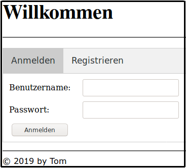
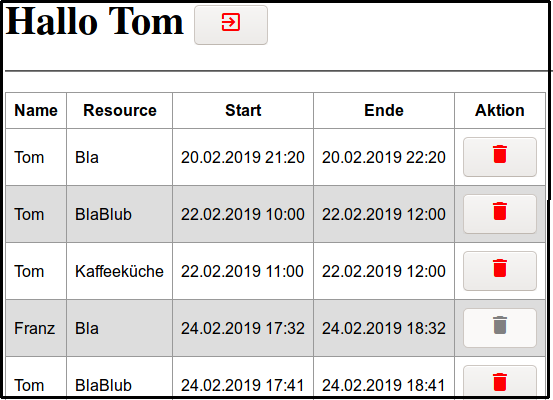

# SpringBootStarter

Eine einfache Terminverwaltung in Java mit
- [**Spring Boot**](https://spring.io/guides/gs/spring-boot/) und
- [**Thymeleaf**](https://www.thymeleaf.org/doc/tutorials/3.0/usingthymeleaf.html).

Das Maven-Projekt besteht aus einem WEB-Modul [**secureWebApp**](secureWebApp) mit Loginseite zur Anmeldung
existierender und Registrierung neuer Benutzer und einer Seite zur Verwaltung der Termine.

Im Hintergrund arbeitet ein Backend-Modul [**backendServices**](backendServices) mit einer Datenbank für User und Termine und den
REST-Services für den Zugriff auf die Datenbank:

Die Datenbank wird in [**application.properties**](backendServices/src/main/resources/application.properties) definiert
und muss in den meisten Fällen für die eigene Umgebung angepasst werden.

